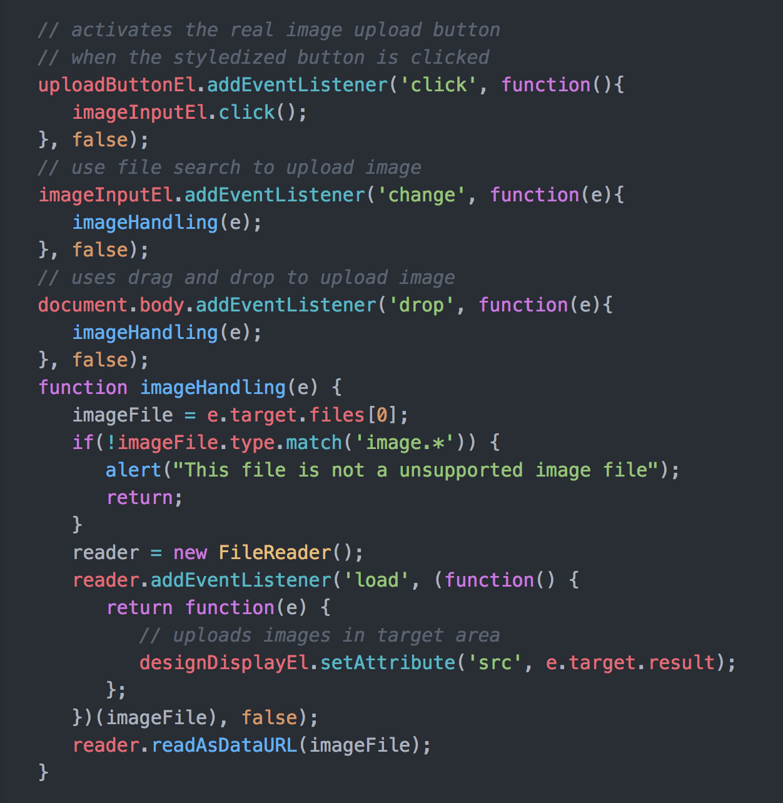
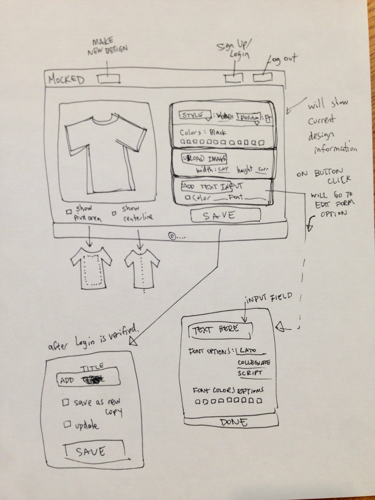
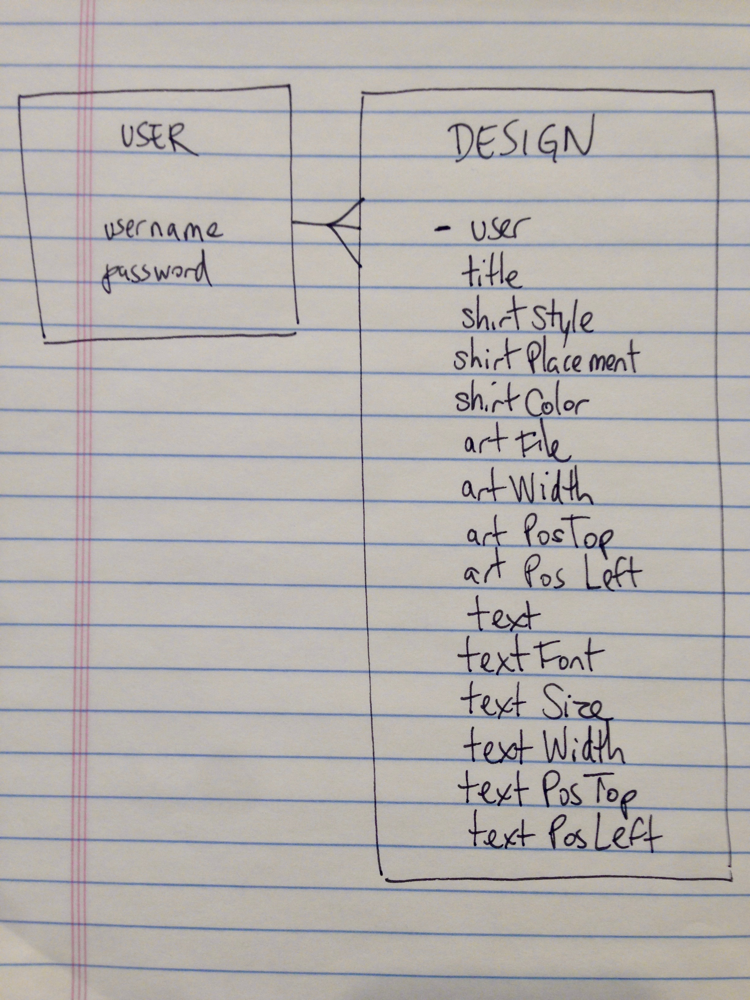

# Mocked

## An app for creating t-shirt mockups

## User Stories
MOCKED is an app for users to layout their design ideas onto t-shirt templates before going to a screen-printer. A user will start by choosing a t-shirt style, placement, and color. They can then upload their image, and adjust the size and positioning of the art to standard industry specifications. A user would also be able to add text to their t-shirt layout if desired.

## Technologies and Libraries
<ul>
<li>jQuery & jQueryUI</li>
<li>Django</li>
</ul>

## CODE SNIPPET
Image uploading to the front end by drag and drop/ or file upload capabilities

## Wireframes

## ERD

